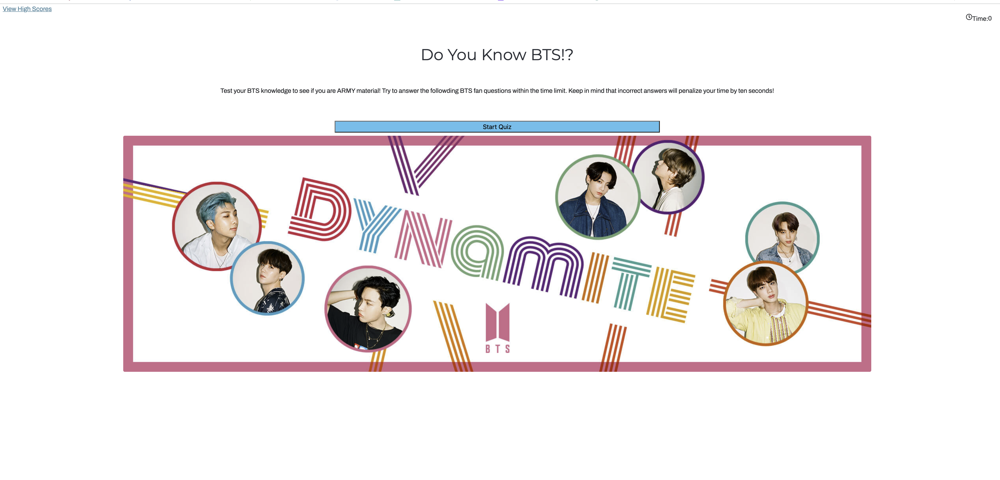

<h1> Code Quiz </h1>

<h2> Description</h2>

This project required buidling a timed quiz that inlcuded both multiple-choice questions and interactive coding challenges. The applicaiton includes the following:  
    <ul>
   <li>Runs in the browser and features dynamically updated HTML and CSS powered by JavaScript code</li>
   <li>Has a clean and polished, responsive user interface that adapts to multiple screen sizes </li>
    </ul>
    

<h2>User Story</h2>

AS A coding boot camp student

I WANT to take a timed quiz on BTS facts that stores high scores

SO THAT I can gauge my BTS knowledge compared to other ARMY members

<h2>Acceptance Criteria</h2>

GIVEN I am taking a code quiz

WHEN I click the start button

THEN a timer starts and I am presented with a question

WHEN I answer a question

THEN I am presented with another question

WHEN I answer a question incorrectly

THEN time is subtracted from the clock

WHEN all questions are answered or the timer reaches

THEN the game is over

WHEN the game is over

THEN I can save my initials and my score

<h2>Deployed Page</h2>

Page published at: https://acampau.github.io/code-quiz/

<h2>Screenshot</h2>

